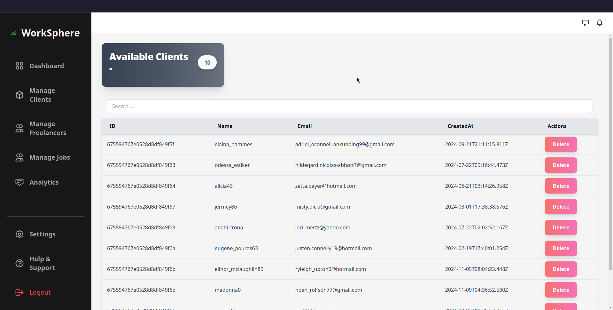

# WorkSphere

> Group No - 35

## Description

- Freelancer/Job Board similar to Fiverr/LinkedIn

## Demo

[](https://www.youtube.com/watch?v=ykLvB1Hzy9o)

## Performance Results

| Metric     | Without Cache | With Cache | Improvement      |
| ---------- | ------------- | ---------- | ---------------- |
| **Min**    | 8 ms          | 1 ms       | **87.5% faster** |
| **Max**    | 79 ms         | 41 ms      | **48.1% faster** |
| **Mean**   | 10.4 ms       | 2.1 ms     | **79.8% faster** |
| **Median** | 10.1 ms       | 2 ms       | **80.2% faster** |
| **P95**    | 13.1 ms       | 3 ms       | **77.1% faster** |
| **P99**    | 26.8 ms       | 4 ms       | **85.1% faster** |

## Team Members

| Name                        | Roll No      |
| --------------------------- | ------------ |
| Harshawardhan Mahadev Patil | S20220010167 |
| Sushant Gadyal              | S20220010218 |
| Satish Anantrao Pandhare    | S20220010163 |
| Vighnesh Suryakant Barage   | S20220010033 |
| Rahul Banoth                | S20220010031 |

## Tech Stack

<div align="left">
  <h3>Frontend</h3>  
  
  
  
  
  
  
</div>

<div align="left">
  <h3>Backend</h3>  
  
  
  
  
  
  
  
  
</div>

## Instructions

### Frontend

1. Go to client directory

```bash
# WorkSphere >
cd client
```

2. Install dependencies

```bash
# WorkSphere/client >
npm install
```

3. Run the development server

```bash
# WorkSphere/client >
npm run dev
```

### Backend

> [!NOTE]
> Make sure you have mongodb installed

1. Go the server directory

```bash
# WorkSphere >
cd server
```

2. Install dependencies

```bash
# WorkSphere/server >
npm i
```

3. Generate Dummy Data

```bash
# WorkSphere/server >
node data/generateData.js
```

4. Create .env

```bash
# WorkSphere/server >
touch .env

# and paste the following
PORT=3000
DB_URI=mongodb://localhost:27017/WorkSphere
NODE_ENV=development
JWT_SECRET=<ANY_JWT_SECRET_KEY>
JWT_EXPIRES_IN=90d
JWT_COOKIE_EXPIRES_IN=90
```

5. Run the server

```bash
npm run dev
```

## Docs

API Docs available at `localhost:3000/docs` or [Here](https://worksphere-dq95.onrender.com/docs)

## Demo

### Home Page


### Find Works Page


### Freelancer Dashboard


### Admin Dashboard


### Admin Dashboard Analytics




### Client Dashboard


### Business Page


### About Us


