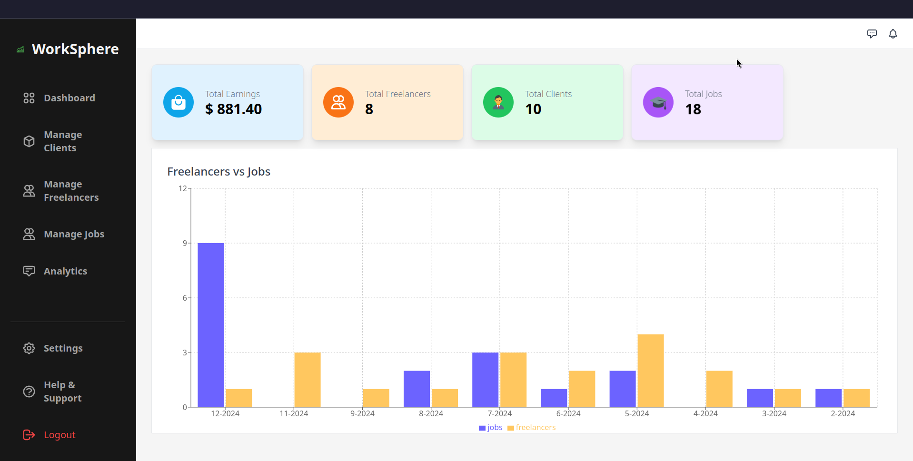

<div align="center">
  
  
  # WorkSphere
  
  **A Modern Freelancer Platform Connecting Talent with Opportunity**
  
  [](https://www.youtube.com/watch?v=ykLvB1Hzy9o)
  [](https://worksphere-dq95.onrender.com/docs)
  [](https://worksphere-dq95.onrender.com)
  
</div>

## 📝 Overview

**WorkSphere** is a comprehensive freelancer and job board platform that bridges the gap between talented freelancers and businesses seeking quality services. Built with modern web technologies, it provides an intuitive experience similar to platforms like Fiverr and LinkedIn, but with enhanced features for better user engagement and performance.

### ✨ Key Features

- 🎯 **Smart Job Matching** - AI-powered recommendations for freelancers and clients
- 💬 **Real-time Messaging** - Seamless communication between freelancers and clients
- 📊 **Analytics Dashboard** - Comprehensive insights for admins and users
- 🔐 **Secure Authentication** - JWT-based authentication with role-based access
- 💰 **Payment Integration** - Secure payment processing for transactions
- 🚀 **Performance Optimized** - Redis caching for lightning-fast responses
- 📱 **Responsive Design** - Mobile-first approach with modern UI/UX

## 🎬 Demo

[](https://www.youtube.com/watch?v=ykLvB1Hzy9o)

## ⚡ Performance Metrics

Our platform delivers exceptional performance with Redis caching implementation:

| Metric     | Without Cache | With Cache | Improvement      |
| ---------- | ------------- | ---------- | ---------------- |
| **Min**    | 8 ms          | 1 ms       | **87.5% faster** |
| **Max**    | 79 ms         | 41 ms      | **48.1% faster** |
| **Mean**   | 10.4 ms       | 2.1 ms     | **79.8% faster** |
| **Median** | 10.1 ms       | 2 ms       | **80.2% faster** |
| **P95**    | 13.1 ms       | 3 ms       | **77.1% faster** |
| **P99**    | 26.8 ms       | 4 ms       | **85.1% faster** |

## 🛠️ Tech Stack

<div align="center">
  
### Frontend


### Backend


### Tools & DevOps


</div>

## 🚀 Quick Start

### Prerequisites

Before running the application, ensure you have the following installed:

- **Node.js** (v18 or higher)
- **MongoDB** (v5.0 or higher)
- **Redis** (v6.0 or higher)
- **npm** or **pnpm** (recommended)

### 🔧 Installation & Setup

#### Option 1: Run Both Frontend & Backend Together

```bash
# Clone the repository
git clone https://github.com/harsh-m-patil/WorkSphere.git
cd WorkSphere

# Install root dependencies
npm install

# Install client dependencies
cd client && npm install && cd ..

# Install server dependencies
cd server && npm install && cd ..

# Start both frontend and backend
npm run dev
```

#### Option 2: Run Frontend & Backend Separately

<details>
<summary><b>🎨 Frontend Setup</b></summary>

```bash
# Navigate to client directory
cd client

# Install dependencies
npm install

# Start development server
npm run dev

# Build for production
npm run build
```

**Frontend will be available at:** `http://localhost:5173`

</details>

<details>
<summary><b>⚙️ Backend Setup</b></summary>

```bash
# Navigate to server directory
cd server

# Install dependencies
npm install

# Generate dummy data (optional)
node data/generateData.js

# Create environment file
cp .env.example .env
```

**Configure your `.env` file:**

```env
PORT=3000
DB_URI=mongodb://localhost:27017/WorkSphere
NODE_ENV=development
JWT_SECRET=your-super-secret-jwt-key-here
JWT_EXPIRES_IN=90d
JWT_COOKIE_EXPIRES_IN=90
REDIS_URL=redis://localhost:6379
```

```bash
# Start development server
npm run dev

# Run tests
npm test

# Run with coverage
npm run coverage
```

**Backend will be available at:** `http://localhost:3000`
**API Documentation:** `http://localhost:3000/docs`

</details>

### 🐳 Docker Setup

```bash
# Build and run with Docker Compose
docker-compose up -d

# View logs
docker-compose logs -f

# Stop services
docker-compose down
```

## 🏗️ Architecture

```
WorkSphere/
├── client/                 # React frontend
│   ├── src/
│   │   ├── components/     # Reusable UI components
│   │   ├── pages/          # Page components
│   │   ├── hooks/          # Custom React hooks
│   │   ├── store/          # State management
│   │   └── utils/          # Utility functions
│   └── public/             # Static assets
├── server/                 # Express backend
│   ├── controllers/        # Route handlers
│   ├── models/             # Database models
│   ├── routes/             # API routes
│   ├── middlewares/        # Custom middleware
│   ├── utils/              # Utility functions
│   └── config/             # Configuration files
└── assets/                 # Documentation images
```

## 🔗 API Endpoints

### Authentication

- `POST /api/auth/register` - User registration
- `POST /api/auth/login` - User login
- `POST /api/auth/logout` - User logout
- `GET /api/auth/me` - Get current user

### Users

- `GET /api/users` - Get all users
- `GET /api/users/:id` - Get user by ID
- `PUT /api/users/:id` - Update user profile
- `DELETE /api/users/:id` - Delete user

### Works/Jobs

- `GET /api/works` - Get all works
- `POST /api/works` - Create new work
- `GET /api/works/:id` - Get work by ID
- `PUT /api/works/:id` - Update work
- `DELETE /api/works/:id` - Delete work

For complete API documentation, visit `/docs` endpoint when running the server.

## 🧪 Testing

```bash
# Run all tests
npm test

# Run tests with coverage
npm run coverage

# Run specific test file
npm test auth.test.js

# Run tests in watch mode
npm test
```

## 📈 Performance Testing

We use Artillery for load testing:

```bash
# Run performance tests
cd server
npm run artillery

# Results are saved in results/ directory
```

## 🤝 Contributing

We welcome contributions! Please see our [Contributing Guide](CONTRIBUTING.md) for details.

### Development Workflow

1. **Fork** the repository
2. **Create** a feature branch (`git checkout -b feature/amazing-feature`)
3. **Commit** your changes (`git commit -m 'Add some amazing feature'`)
4. **Push** to the branch (`git push origin feature/amazing-feature`)
5. **Open** a Pull Request

### Code Style

- We use **ESLint** for JavaScript linting
- We use **Prettier** for code formatting
- Follow the existing code style and patterns

```bash
# Run linting
npm run lint

# Fix linting issues
npm run lint --fix

# Format code
npm run format
```

## 🖼️ Screenshots

<div align="center">

### 🏠 Home Page


### 💼 Find Works Page

<div style="display: flex; gap: 10px;">
  
  
</div>

### 👨‍💻 Freelancer Dashboard

<div style="display: flex; gap: 10px;">
  
  
</div>

### 👑 Admin Dashboard

<div style="display: flex; gap: 10px;">
  
  
</div>

### 🏢 Client Dashboard


### 📊 Business Analytics


### ℹ️ About Us


</div>

## 🌟 Features Showcase

### For Freelancers

- ✅ **Profile Creation** - Showcase skills and portfolio
- ✅ **Job Applications** - Apply to relevant projects
- ✅ **Earnings Tracking** - Monitor income and payments

### For Clients

- ✅ **Post Projects** - Create detailed job listings
- ✅ **Browse Talent** - Find skilled freelancers
- ✅ **Secure Payments** - Protected transaction system

### For Admins

- ✅ **User Management** - Oversee platform users
- ✅ **Analytics Dashboard** - Comprehensive insights
- ✅ **Content Moderation** - Maintain platform quality
- ✅ **Financial Overview** - Transaction monitoring

## 🚀 Deployment

### Frontend Deployment (Vercel)

```bash
# Build the project
npm run build

# Deploy to Vercel
vercel --prod
```

### Backend Deployment (Render/Railway)

```bash
# Set environment variables
# Deploy using your preferred platform
```

### Environment Variables

#### Frontend (.env)

```env
VITE_API_URL=http://localhost:3000/api
VITE_APP_NAME=WorkSphere
```

#### Backend (.env)

```env
PORT=3000
DB_URI=mongodb://localhost:27017/WorkSphere
NODE_ENV=production
JWT_SECRET=your-super-secret-jwt-key
JWT_EXPIRES_IN=90d
JWT_COOKIE_EXPIRES_IN=90
REDIS_URL=redis://localhost:6379
CORS_ORIGIN=http://localhost:5173
```

## 📚 Documentation

- **API Documentation**: Available at `/docs` endpoint
- **Frontend Components**: Check `client/src/components/`
- **Backend Routes**: Check `server/routes/`
- **Database Models**: Check `server/models/`

## 🔒 Security Features

- **JWT Authentication** - Secure token-based auth
- **Password Hashing** - bcrypt for password security
- **Input Validation** - Comprehensive request validation
- **Rate Limiting** - Prevent abuse and spam
- **CORS Protection** - Cross-origin request security
- **Helmet.js** - Security headers
- **MongoDB Sanitization** - Prevent NoSQL injection

## 🙏 Acknowledgments

- **MongoDB** - For the powerful NoSQL database
- **Express.js** - For the robust web framework
- **React** - For the amazing frontend library
- **TailwindCSS** - For the utility-first CSS framework
- **Vite** - For the lightning-fast build tool
